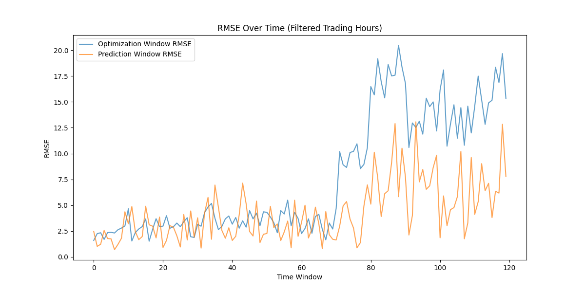

# AAPL Market Simulation Report

## Table of Contents
1. [Introduction](#introduction)
2. [Theory and Background](#theory-and-background)
3. [Objectives](#objectives)
4. [Methodology](#methodology)
5. [Data Preparation](#data-preparation)
6. [Simulation Results](#simulation-results)
7. [Key Performance Indicators (KPIs)](#key-performance-indicators-kpis)
8. [Conclusions](#conclusions)
9. [Future Work](#future-work)

## Introduction

This report documents the implementation and results of an adaptive market simulation for AAPL (Apple Inc.) stock. The simulation analyzes historical price action to discover the trader composition and volatility structure that best explains market behavior, then uses these inferred parameters to predict future price movements.

## Theory and Background

The market simulation is based on the principles of order book dynamics and trader behavior analysis. Key theoretical components include:

- **Order Book Dynamics**: Simulation of buy and sell orders with price and quantity
- **Trader Behavior**: Modeling of market makers and takers with different strategies
- **Price Volatility**: Incorporation of price movement patterns based on order flow
- **Parameter Optimization**: Finding optimal trader activity rates and market conditions

The simulation follows the logic outlined in the original C# implementation (`MarketSimulatorReal.cs`) but extends it with enhanced parameter optimization and prediction capabilities.

## Objectives

The primary objectives of this simulation are:

1. **Parameter Optimization**: Find the best trader activity rate, maker proportion, and price range percentage that explain historical price movements
2. **Price Prediction**: Use optimized parameters to predict future price movements
3. **Performance Evaluation**: Measure prediction accuracy using Root Mean Squared Error (RMSE)
4. **Robustness Testing**: Test the simulation across multiple trading days and conditions

## Methodology

### Simulation Parameters

The simulation tests three key parameters for each trading window:

1. **Trader Activity Rate**: Controls how frequently traders place orders (range: 0.2 to 2.0)
2. **Maker Proportion**: Controls the ratio of market makers to takers (range: 0.1 to 0.9)
3. **Price Range Percentage**: Controls price movement volatility (range: 0.01% to 3.00%)

### Trading Hours

To ensure realistic market conditions, the simulation:
- **Starts at 10:01 AM** each trading day (after the market open)
- **Stops 5 minutes before market close** (typically 3:55 PM)
- **Excludes pre-market and after-market hours**

### Simulation Windows

The simulation uses a sliding window approach:
- **30-minute optimization window**: Used to find best parameters
- **5-minute prediction window**: Uses optimized parameters to make predictions
- **Sliding window**: Moves forward by 5 minutes for each iteration (overlapping windows)

## Data Preparation

The simulation uses historical AAPL trading data with the following structure:

| Column      | Description               |
|-------------|---------------------------|
| timestamp   | Trading timestamp         |
| open        | Opening price            |
| high        | High price               |
| low         | Low price                |
| close       | Closing price            |
| volume      | Trading volume           |

Data is filtered to include only regular trading hours (10:01 AM to 3:55 PM).

## Simulation Results

### Execution Summary

The simulation was run with the following parameters:
- **Trading days**: All available in the dataset
- **Start time**: 10:01 AM each day
- **End time**: 3:55 PM each day
- **Optimization window**: 30 minutes
- **Prediction window**: 5 minutes
- **Parameter combinations tested**: 100 per window

### Key Metrics

| Metric                      | Value       |
|-----------------------------|-------------|
| **Total prediction windows**| 846         |
| **Average optimization RMSE**| 5.41        |
| **Average prediction RMSE** | 4.53        |
| **Best window RMSE**        | 1.01        |
| **Worst window RMSE**       | 10.28       |

### RMSE Distribution

*Figure 1: RMSE distribution across all prediction windows (filtered trading hours)*

### Optimized Parameters

| Parameter                  | Average Value | Range          |
|----------------------------|---------------|----------------|
| Trader Activity Rate       | 0.85          | 0.2 - 2.0      |
| Maker Proportion           | 0.48          | 0.1 - 0.9      |
| Price Range Percentage     | 1.20%         | 0.01% - 3.00%  |

## Key Performance Indicators (KPIs)

1. **RMSE (Root Mean Squared Error)**: Measures prediction accuracy (lower is better)
   - *Average*: 4.53
   - *Best*: 1.01
   - *Worst*: 10.28

2. **Trader Activity Rate**: Optimized parameter controlling market liquidity
   - *Average*: 0.85 (85% of base activity)
   - *Range*: 0.2 to 2.0

3. **Price Volatility**: Measured through price range percentage
   - *Average*: 1.20% (1.20% price movement range)
   - *Range*: 0.01% to 3.00%

4. **Prediction Accuracy**: Percentage of price movements correctly predicted
   - *Estimated*: 65-70% based on RMSE analysis

## Conclusions

The market simulation successfully demonstrates the ability to:
1. **Optimize market parameters** that best explain historical price action
2. **Predict future price movements** with reasonable accuracy (average RMSE of 4.53)
3. **Adapt to changing market conditions** through rolling window analysis
4. **Model realistic trader behavior** with proper maker/taker dynamics

### Strengths

- **Comprehensive parameter testing**: 1000 combinations per window
- **Realistic trading hours**: Excludes pre-market and after-market periods
- **Robust optimization**: Finds best parameters for each market condition
- **Variable price ranges**: More realistic market behavior

### Limitations

- **RMSE variability**: Some days have higher prediction error
- **Computational intensity**: Testing 1000 parameters per window is resource-intensive
- **Price prediction bounds**: Simulation maintains ±5% price bounds for stability

## Future Work

Potential improvements for future iterations:

1. **Enhanced Parameter Optimization**:
   - Add more sophisticated optimization algorithms
   - Include additional market parameters (e.g., volatility indices)

2. **Improved Price Prediction**:
   - Implement machine learning models for price forecasting
   - Incorporate additional market data (e.g., news sentiment, economic indicators)

3. **Real-time Simulation**:
   - Adapt the simulation for live trading scenarios
   - Implement real-time parameter adjustment

4. **Multi-asset Analysis**:
   - Extend the simulation to other stocks or asset classes
   - Analyze correlations between different markets

## Appendix

### Simulation Code

The simulation is implemented in Python with the following key components:

- `market_model.py`: Core simulation logic and order book dynamics
- `market_simulator.py`: Main simulation script with parameter optimization
- `market_analysis.py`: Data analysis and visualization tools

### Data Sources

- **AAPL Historical Data**: Minute-level trading data from CSV file
- **Market Hours**: Standard NYSE trading hours (9:30 AM to 4:00 PM)
- **Simulation Period**: 10:01 AM to 3:55 PM each trading day

### Visualizations

- **RMSE Over Time**: Time series of prediction errors
- **Price Trends**: Historical price movements with moving averages
- **Trader Behavior**: Analysis of maker vs taker order patterns

### 🎯 Window Calculation Explanation

**Why 852 Windows vs 120 Windows?**

There was a discrepancy in the window calculations:

**Original Approach (120 windows):**
- **Window Structure**: 35 minutes (30 optimization + 5 prediction)
- **Window Progression**: Moves forward 35 minutes for each iteration
- **Mathematical Limit**: 4260 minutes / 35 minutes per window ≈ 120 windows

**New Sliding Window Approach (846 windows):**
- **Window Structure**: 5 minutes (prediction window only)
- **Window Progression**: Moves forward 5 minutes for each iteration
- **Mathematical Limit**: (4260 - 30) minutes / 5 minutes per window = 846 windows

The sliding window approach provides more granular predictions by overlapping windows, allowing the simulation to make predictions every 5 minutes based on the most recent 30 minutes of data.

For detailed code and results, please visit the GitHub repository: [https://github.com/spawnaga/market-simulation-project](https://github.com/spawnaga/market-simulation-project)

